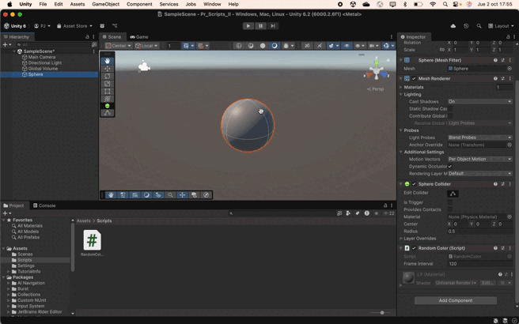
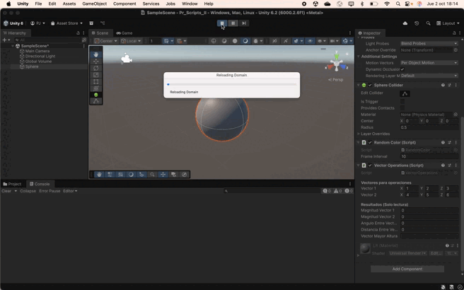
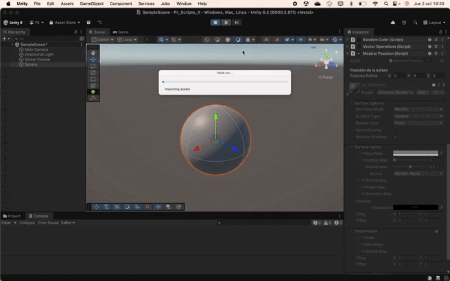
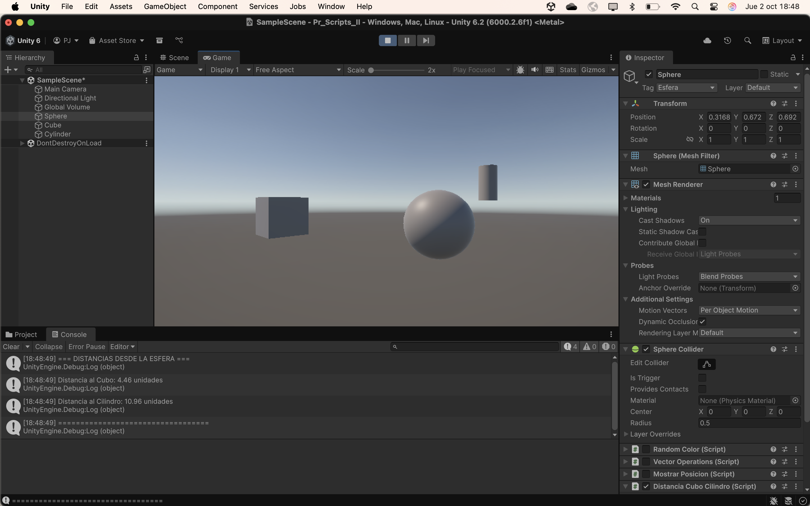
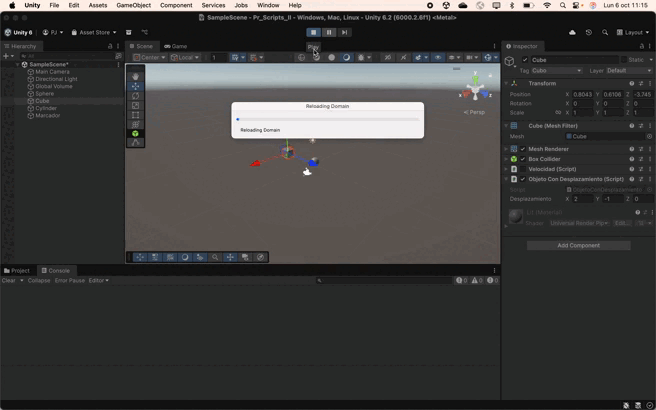
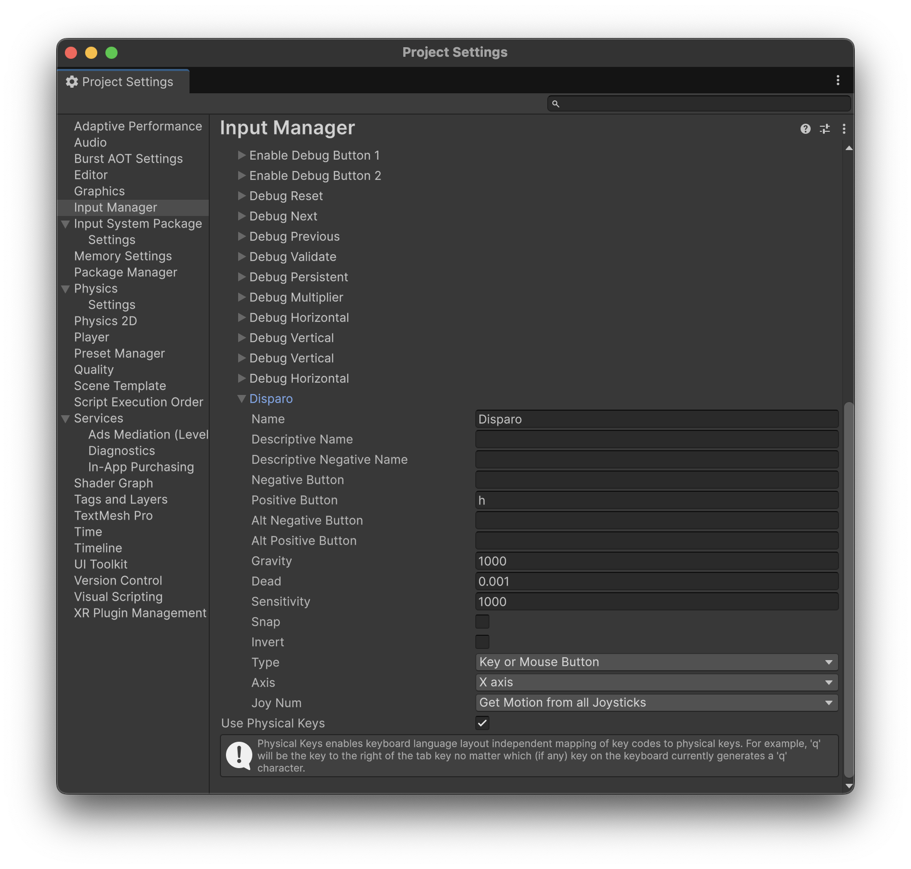
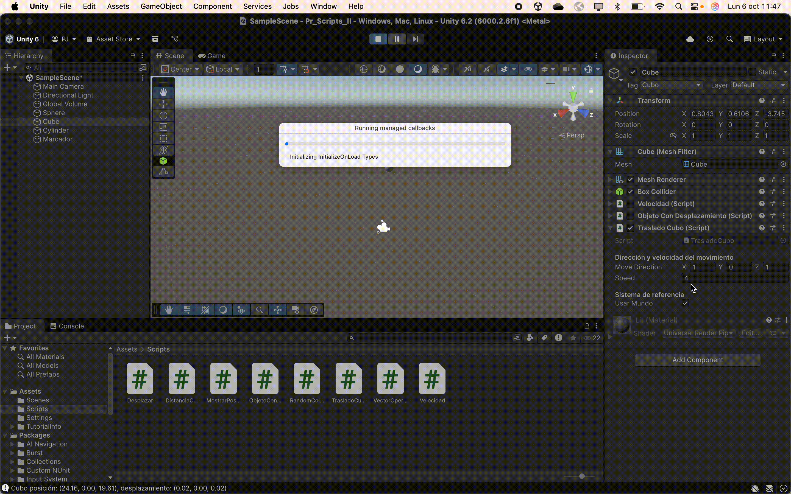

# Práctica de Scripts: Movimiento en Unity

## Ejercicio 1: Vector de color aleatorio
**Objetivo:**  
Crea un script asociado a un objeto en la escena que inicialice un vector de 3
posiciones con valores entre 0.0 y 1.0, para tomarlo como un vector de color (Color).
Cada 120 frames se debe cambiar el valor de una posición aleatoria y asignar el
nuevo color al objeto. Parametrizar la cantidad de frames de espera para poderlo
cambiar desde el inspector.

**Implementación:**  
Se ha creado un script `RandomColor` que inicializa un vector de color aleatorio y lo asigna al material del objeto. Cada 120 frames, se cambia un componente aleatorio del color y se actualiza el material. El número de frames entre cambios es configurable desde el Inspector.

**Resultados:**  
- El objeto cambia de color periódicamente según la configuración de frames. Cuanto menor es el número de frames, más rápido cambia el color.

**Captura:**  

---

## Ejercicio 2: Operaciones con vectores
**Objetivo:**  
Crea un script asociado a la esfera con dos variables Vector3 públicas. Dale valor a
cada componente de los vectores desde el inspector. Muestra en la consola:
a. La magnitud de cada uno de ellos.
b. El ángulo que forman
c. La distancia entre ambos.
d. Un mensaje indicando qué vector está a una altura mayor.
Muestra en el inspector cada uno de esos valores.

**Implementación:**  
Se ha creado un script `VectorOperations` que define dos vectores públicos. Se calculan y muestran en consola y en el Inspector: la magnitud, el ángulo entre ellos, la distancia y cuál está a mayor altura.

**Resultados:**  
- Se muestran correctamente todos los valores calculados en consola y en Inspector.

**Captura:**  

---

## Ejercicio 3: Posición de la esfera
**Objetivo:**  
Muestra en pantalla el vector con la posición de la esfera.

**Implementación:**  
- Obtención de la posición mediante `transform.position` como atributo público en la clase `MostrarPosición`.

**Resultados:**  
- La posición de la esfera se visualiza correctamente en pantalla a través del Inspector.

**Captura:**  

---

## Ejercicio 4: Distancia a cubo y cilindro
**Objetivo:**  
Crea un script para la esfera que muestre en consola la distancia a la que están el
cubo y el cilindro.

**Implementación:**  
En la clase `DistanciaCuboCilindro`, se han definido dos variables públicas de tipo `GameObject` para referenciar el cubo y el cilindro. En el método `Update`, se calcula la distancia a cada uno usando `Vector3.Distance` y se imprime en consola.
Los objetos se encuentran mediante los tags "Cubo" y "Cilindro" y la distancia se calcula con `Vector3.Distance`.

**Resultados:**  
- La consola muestra la distancia de la esfera a ambos objetos.

**Captura:**  

---

## Ejercicio 5: Desplazamientos configurables con la barra espaciadora
**Objetivo:**  
Selecciona tres posiciones en tu escena a través de un objeto invisible (marcador)
que incluya 3 vectores numéricos para configurar posiciones en las que quieres
ubicar los objetos en respuesta a pulsar la barra espaciadora. Estos vectores
representan un desplazamiento respecto a la posición original de cada objeto. Crea
un script que ubique en las posiciones configuradas cuando el usuario pulse la barra
espaciadora.

**Implementación:**  
Se han implementado dos scripts: `Desplazar`y `ObjetoConDesplazamiento`.  
- `ObjetoConDesplazamiento`: Define un vector público `desplazamiento` para cada objeto.  
- `Desplazar`: Detecta la pulsación de la barra espaciadora y mueve cada objeto a su posición original más el desplazamiento configurado.

**Resultados:**  
- Al pulsar la barra espaciadora, los objetos se desplazan a las posiciones configuradas.

**Captura:**  

---

## Ejercicio 6: Velocidad y teclas de flecha
**Objetivo:**  
Agrega un campo velocidad a un cubo y asígnale un valor que se pueda cambiar en
el inspector de objetos. Muestra la consola el resultado de multiplicar la velocidad
por el valor del eje vertical y por el valor del eje horizontal cada vez que se pulsan
las teclas flecha arriba-abajo ó flecha izquierda-derecha. El mensaje debe comenzar
por el nombre de la flecha pulsada.

**Implementación:**  
Se ha creado un script `Velocidad` que define una variable pública `velocidad`. En el método `Update`, se detectan las pulsaciones de las flechas y se calcula el producto de la velocidad por el valor del eje correspondiente y el tiempo, mostrando el resultado en consola. Se ha utilizado `Input.GetAxis("Vertical")` y `Input.GetAxis("Horizontal")` para obtener los valores de los ejes y `Input.GetKey()` para detectar las teclas.

**Resultados:**  
- Se muestran los valores correspondientes al pulsar las flechas, indicando la flecha que se ha pulsado.

**Captura:**  

---

## Ejercicio 7: Mapeo de la tecla H a disparo
**Objetivo:**  
Asignar la tecla H a una función de disparo.

**Implementación:**  
En el editor, se ha mapeado la tecla H en Edit > Project Settings > Input Manager, añadiendo una nueva entrada llamada "Disparar" y asignándole la tecla H y con type "Key or Mouse Button".

**Captura:**  

---

## Ejercicio 8: Movimiento con vector y velocidad configurable
**Objetivo:**  
Crea un script asociado al cubo que en cada iteración traslade al cubo una cantidad
proporcional un vector que indica la dirección del movimiento: moveDirection que
debe poder modificarse en el inspector. La velocidad a la que se produce el
movimiento también se especifica en el inspector, con la propiedad speed.
Inicialmente la velocidad debe ser mayor que 1 y el cubo estar en una posición y=0.
En el informe de la práctica comenta los resultados que obtienes en cada una de las
siguientes situaciones:
a. duplicas las coordenadas de la dirección del movimiento.
b. duplicas la velocidad manteniendo la dirección del movimiento.
c. la velocidad que usas es menor que 1
d. e. la posición del cubo tiene y>0
intercambiar movimiento relativo al sistema de referencia local y el mundial.

**Implementación:**  
Se ha creado un script `TrasladoCubo` que define dos variables públicas: `moveDirection` (Vector3) y `speed` (float). En el método `Update`, se traslada el cubo utilizando `transform.Translate(moveDirection * speed * Time.deltaTime, Space.World)` para movimiento en espacio mundial y `Space.Self` para espacio local, dependiendo de una variable booleana `usarMundo`.

**Resultados y pruebas:**  
- a. Duplicar las coordenadas de dirección aumenta proporcionalmente el desplazamiento porque se multiplica la distancia recorrida en cada dirección.  

- b. Duplicar velocidad produce mayor avance en la misma dirección.

- c. Velocidad < 1 provoca que el movimiento sea tan lento que pueda llegar a ser casi imperceptible.

- d. Con posición inicial con y > 0 se produce el mismo desplazamiento pero a disntinta altura.

- e. Cambio entre espacio local y mundial: Si es espacio local, el cubo se mueve de acuerdo al sistema mundial, mientras
que el sistema local hace que el cubo se mueva según su propio sistema de referencia local.

---

## Ejercicios 9 y 10: Movimiento con teclas
**Objetivo:**  
Mueve el cubo con las teclas de flecha arriba-abajo, izquierda-derecha a la velocidad
speed. Cada uno de estos ejes implican desplazamientos en el eje vertical y
horizontal respectivamente. Mueve la esfera con las teclas w-s (movimiento vertical)
a-d (movimiento horizontal).

Adapta el movimiento en el ejercicio 9 para que sea proporcional al tiempo
transcurrido durante la generación del frame.

**Implementación:**  
Se han creado dos scripts: `MoverCubo` y `MoverEsfera`.  
- `MoverCubo`: Utiliza `Input.GetKey(KeyCode.LeftArrow)`, `KeyCode.RightArrow`, `KeyCode.UpArrow`, `KeyCode.DownArrow` para mover el cubo con las flechas.  
- `MoverEsfera`: Utiliza `Input.GetKey(KeyCode.W)`, `KeyCode.S`, `KeyCode.A`, `KeyCode.D` para mover la esfera con W-A-S-D.
Ambos scripts utilizan una variable pública `speed` para controlar la velocidad de movimiento.

Si en alguno de los scripts se utilizara `Input.GetAxis`, se produciría interferencia entre los movimientos de ambos objetos, ya que ambos scripts responderían a las mismas entradas de teclado.

Para el ejercicio 10, se ha modificado ambos scripts para multiplicar el desplazamiento por `Time.deltaTime`, haciendo que el movimiento sea independiente de los FPS.

**Resultados:**  
- El cubo responde a flechas, la esfera a W-A-S-D, sin interferencias entre ellos.

**Captura:**  

---

## Ejercicio 11: Cubo hacia la esfera
**Objetivo:**  
Adapta el movimiento en el ejercicio 10 para que el cubo se mueva hacia la posición
de la esfera. Debes considerar que el avance no debe estar influenciado por cuánto
de lejos o cerca estén los dos objetos.

**Implementación:**  
Mediante el script `MoverCuboAEsfera`, se ha implementado el movimiento del cubo hacia la esfera utilizando `Vector3 direction = (esfera.position - transform.position).normalized;` para obtener la dirección normalizada hacia la esfera. El cubo se mueve en esa dirección con una velocidad constante multiplicada por `Time.deltaTime`.

**Resultados:**  
- El cubo avanza hacia la esfera independientemente de la distancia inicial.

**Captura:**  

---

## Ejercicio 12: Cubo mirando siempre a la esfera
**Objetivo:**  
Adapta el movimiento en el ejercicio 11 de forma que el cubo avance mirando
siempre hacia la esfera, independientemente de la orientación de su sistema de
referencia. Para ello, el cubo debe girar de forma que el eje Z positivo apunte hacia
la esfera . Realiza pruebas cambiando la posición de la esfera mediante las teclas
awsd

**Implementación:**  
Se ha creado el script `MoverCuboMirandoEsfera` que utiliza `transform.LookAt(esfera.position);` para hacer que el cubo siempre mire hacia la esfera antes de moverse hacia ella. El movimiento se realiza en la dirección del eje Z positivo del cubo.

**Resultados:**  
- El cubo siempre apunta a la esfera y se mueve correctamente, incluso al mover la esfera con W-A-S-D.

**Captura:**  

---

## Ejercicio 13: Girar con eje Horizontal y avanzar hacia adelante
**Objetivo:**  
Utilizar el eje “Horizontal” para girar el objetivo y que avance siempre en la dirección
hacia adelante.

**Implementación:**  
Se ha creado el script `GirarYAvanzar` que utiliza `Input.GetAxis("Horizontal")` para girar el cubo alrededor del eje Y. El cubo avanza constantemente en la dirección de su eje Z positivo utilizando `transform.Translate(Vector3.forward * speed * Time.deltaTime);`.

**Resultados:**  
- El cubo gira con las flechas izquierda/derecha (o A/D) y avanza constantemente hacia adelante.  

**Captura:**  

